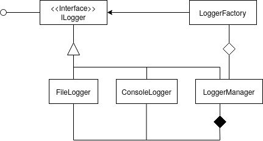

# Design Spec
# Logging Framework
_Prepared by Navaneeth M Nambiar, 111701033 on 2020-10-20_

## Overview
A logger module is an important module of a software project that enables the developer to understand
the execution of their components and track bugs and errors. This module will be used by all other modules.
The logging framework contains multiple log levels and also has different configuration options.

## Objective
* Provide a single Interface for Logging that can be used by different modules.
	* The interface must be simple and scalable.
	* There must be only one instance of the Logger throughout one specific execution of the program
	* Multiple methods may access the Logger through its interface. However, synchronisation is to be ensured
* Implement a File Logger and a Console Logger
	* File Logger is responsible for writing all the log messages to a uniquely named log-file
	* Console Logger enables real time log output to the Terminal/Console while the program is executing
	* Logs are to be printed/written in a specified format
* Add configuration options
	* Prior to execution, it must be possible to set the Log Level
	* An option to have either File logging or Console logging or both
	* Console logging can be formatted and printed
* Extend File handling and Console printing for re-use in Test Harness, if possible

## Class Diagram


## Interface
```java
	public interface ILogger {
		void log(enum moduleIdentifier, enum logLevel, string message);
	}
```

## Usage
```java
	// import the logger Interface and loggerFactory to get the singleton object
	import infrastructure.Logger.LoggerFactory;
	import infrastructure.Logger.ILogger;

	// import enums for module names and log levels
	import infrastructure.Logger.moduleID
	import infrastructure.Logger.logLevelID

	public class Shape {
		
		// initialise a reference to the logger singleton object
		ILogger shapeLogger = LoggerFactory.getLogger();

		public static Object(List<Int> Dimensions) {
			
			// invoke the log interface with arguments
			shapeLogger.log(moduleID.PROCESSING, logLevelID.INFO, "assessing dimensions to create shape");
			...

		}
	}	
```

## Design Analysis
### Creation of Instance
1. The Logging framework will have only one instance throughout one entire execution of the application. This is commonly
   refered to as a Singleton object pattern.
2. All modules that will be using the Logging interface will be referencing this module. Thus, the module will be
   synchronised and have exclusive write. While the actual object and its methods that is referenced has to be
   synchronised, the objects that it composes need just be static.
3. A single instance of the Logging module (called the LoggerManager created by a logger factory) will be composed of two
   implementations of the interface viz. File Logger and Console Logger. However, the internal objects are abstracted away
   from the method callers. This design pattern that closely resembles the Facade object pattern. With this, the user is
   provided with a simple and clean interface hiding a complex setup that does both File and Console logging. This module
   will be provided by a Factory that will create a single instance at first and pass it along for further use. However,
   since it isn't always necessary to keep both File and Console logging, a configuration setting is set up to enable or
   disable File logging and/or Console logging before runtime.
4. A configuration file is provided at $HOME/.config/korakaagaz/loggerconfig.settings. This file is written in XML format.
   XML was chosen due to it being better suited to storing configuration settings with user defined tags compared to JSON
   which has been a possile alternative. However, JSON is mostly to be used as a stream object and also, doesn't support
   comments in between configuration settings. A possible future scope would be to explore other newer methods like HOCON
   or [Lightbend config][lightbend].

### Logging
1. Logs are created during runtime.
2. There are four log levels for messages to be logged:
   * ERROR   : a significant error has occured and the program can halt
   * WARNING : a warning that might indicate possible fault
   * SUCCESS : a successful completion of a particular procedure
   * INFO    : an informative message. Common example would be start/end of a procedure/transaction
   This can be represented by an public enum type that a method caller can use
3. Methods writing their log messages are required to mention their module/package name. These will be stored as a public
   enum type. This might seem redundant and also ask the question whether it would have been possible to find names
   dynamically. This is indeed possible to some extent through Java reflections and the Stack Trace content. However, 
   it would require significant memory usage while executing as in most cases, the contents of the Program Stack have to be
   stored and searched to get the method caller. Also, it might not be possible to extract the module/package name efficiently.
   To reduce the resource footprint of the Logging framework for now, this has not been further explored.
   - For now, Module names are stored as an enum type in the Logging Framework Class.
4. All logs messages follow the format - `[YYYY:MM:DD HH:MM:SS] [logLevel] [moduleName] logMessage`
5. It will be possible to specify the level of logging for a particular execution. This has to be specified in the 
   configuration file ($HOME/.config/korakaagaz/loggerconfig.properties). A Boolean value associated with each Log Level
   option (and default values) that indicate whether those particular log level messages need to be written/printed or not.
6. For file logging
   * The current (default) is $HOME/.local/share/korakaagaz/log/
   * The name of the log file is created at runtime as - YYYY-MM-DD-HH-MM-SS-release.log
   * The FileLogger will be writing to the file at runtime simultaneously after the log method has been called. This is 
     indeed resources intensive (especially on time, as file writes are costly) but at the same time ensures that even if
     the program crashes, the logs will be available until its most recent execution.
7. For console printing:
   Messages printed to the console will maintain the log message format and in edition, have color outputs so as to provide 
   readability in the wall of text. A default color option would be as follows
    - ERROR   : RED
    - WARNING : ORANGE
    - SUCCESS : GREEN
    - INFO    : NO COLOR (i.e. the default color for text in Console gets applied)

### Future Scope of Work
1. A newer configuration file format like [lightbend config][lightbend] or HOCON file.
2. Enable user defined Color options for the logs printed to the logs
3. Custom file location for logs.
4. A better method to enable Dynamic Module/Package/Method extraction
5. Per module config files that enable different modules to specify different Log Levels, provide fine grained control.

[lightbend]: <https://github.com/lightbend/config> "A Configuration Library for JVM languages"
